# PROJECT ABERRATION — INTEGRATION MAP

**Versione:** 2.0  
**Data:** 16 Luglio 2026  
**Status:** ACTIVE  
**Scope:** Dipendenze tra moduli runtime e KB — allineato a WAVE5/WAVE6 aggiornati + Mesh Pipeline

---

## 1. Current Runtime Graph (Stato Effettivo)

```mermaid
graph TD
    ProjectGodot["project.godot"]
    MovementComponent["scripts/components/movement_component.gd"]
    PlayerScript["scripts/player/player.gd"]
    CameraController["scripts/player/camera_controller.gd"]
    HudArtery["scripts/ui/hud_artery.gd"]
    TestLevel["scenes/test/test_level.tscn"]
    PropLibrary["scripts/level/prop_library.gd"]
    PropLibraryGlobal["scripts/level/prop_library_global.gd"]
    PropLibraryLab["scripts/level/prop_library_lab.gd"]
    PropLibraryIndustrial["scripts/level/prop_library_industrial.gd"]
    CheckpointSystem["scripts/level/checkpoint_system.gd"]
    AudioManagers["scripts/audio/*.gd"]
    EnemyBase["scripts/enemies/enemy_base.gd"]
    FSMComponent["scripts/ai/fsm_component.gd"]
    UtilityAI["scripts/ai/utility_ai.gd"]
    BoidsComponent["scripts/ai/boids_component.gd"]
    SpawnManager["scripts/level/spawn_manager.gd"]
    PoolManager["scripts/level/pool_manager.gd"]
    Director["scripts/level/director.gd"]
    Level1["scripts/level/level_1.gd"]
    Level2["scripts/level/level_2.gd"]
    Level3["scripts/level/level_3.gd"]
    MutationSystem["scripts/progression/mutation_system.gd"]
    MutationTree["scripts/progression/mutation_tree.gd"]
    UpgradeSystem["scripts/progression/upgrade_system.gd"]
    MutationUI["scripts/progression/mutation_ui.gd"]
    HordeManager["scripts/level/horde_manager.gd"]
    BossJuggernaut["scripts/boss/boss_juggernaut.gd"]
    BossAssaultRobot["scripts/boss/boss_assault_robot.gd"]
    BossPredatorHeli["scripts/boss/boss_predator_helicopter.gd"]

    ProjectGodot --> TestLevel
    TestLevel --> PlayerScript
    TestLevel --> HudArtery
    TestLevel --> PropLibrary
    TestLevel --> CheckpointSystem
    TestLevel --> AudioManagers
    TestLevel --> EnemyBase
    TestLevel --> SpawnManager
    TestLevel --> PoolManager
    TestLevel --> Director
    TestLevel --> Level1
    TestLevel --> Level2
    TestLevel --> Level3
    TestLevel --> MutationSystem
    TestLevel --> UpgradeSystem
    TestLevel --> MutationUI
    TestLevel --> HordeManager
    TestLevel --> BossJuggernaut
    TestLevel --> BossAssaultRobot
    TestLevel --> BossPredatorHeli

    PlayerScript --> MovementComponent
    PlayerScript --> CameraController
    PlayerScript --> HudArtery
    PlayerScript --> MutationSystem
    PlayerScript --> UpgradeSystem
    PlayerScript --> FrenesiaComponent["scripts/player/frenesia_component.gd"]

    EnemyBase --> FSMComponent
    EnemyBase --> UtilityAI
    EnemyBase --> BoidsComponent
    EnemyBase --> NavigationComponent["scripts/ai/navigation_component.gd"]

    Level1 --> PropLibrary
    Level1 --> PropLibraryGlobal
    Level1 --> CheckpointSystem
    Level1 --> BossJuggernaut

    Level2 --> PropLibraryLab
    Level2 --> PropLibraryGlobal
    Level2 --> CheckpointSystem
    Level2 --> BossAssaultRobot
    Level2 --> TurretEnemy["scripts/enemies/turret_enemy.gd"]
    Level2 --> FlamethrowerEnemy["scripts/enemies/enemy_flamethrower.gd"]
    Level2 --> SniperEnemy["scripts/enemies/enemy_sniper.gd"]
    Level2 --> EngineerEnemy["scripts/enemies/enemy_engineer.gd"]
    Level2 --> MedicEnemy["scripts/enemies/enemy_medic.gd"]

    Level3 --> PropLibraryIndustrial
    Level3 --> PropLibraryGlobal
    Level3 --> CheckpointSystem
    Level3 --> HordeManager
    Level3 --> BossPredatorHeli
    Level3 --> HeavyEnemy["scripts/enemies/enemy_heavy.gd"]
    Level3 --> DroneEnemy["scripts/enemies/enemy_drone.gd"]
    Level3 --> RobotEnemy["scripts/enemies/enemy_robot.gd"]
    Level3 --> EliteEnemy["scripts/enemies/enemy_elite.gd"]
    Level3 --> HelicopterEnemy["scripts/enemies/helicopter_enemy.gd"]

    MutationSystem --> MutationTree
    MutationSystem --> MutationData["scripts/progression/mutation_data.gd"]
    MutationSystem --> FrenesiaComponent
    MutationSystem --> CombatComponent["scripts/player/combat_component.gd"]
    MutationSystem --> MovementComponent
    MutationUI --> MutationSystem
    MutationUI --> FrenesiaComponent
    UpgradeSystem --> CombatComponent
    UpgradeSystem --> MutationUI

    HordeManager --> SpawnManager
    HordeManager --> Director
    HordeManager --> PoolManager

    SpawnManager --> Director

    BossJuggernaut --> EnemyBase
    BossAssaultRobot --> EnemyBase
    BossPredatorHeli --> EnemyBase
```



---

## 2. Wave Target Runtime Graphs

### Wave 1 — Foundation (COMPLETATA)
- **Logica presente**: `player.gd` (movement/camera/health), `movement_component.gd`, `camera_controller.gd`, `hud_artery.gd`, `test_level.tscn` — tutti con codice reale (verificato 2026-07-20).
- **Integrazione asset/animazione COMPLETATA (2026-07-20)**: `player.gd` istanzia via codice `scenes/player/chr_player_rigged_anim.glb` (Skeleton3D 66 ossa + AnimationPlayer 6 anim: idle/walk/run/jump/attack/death). `AnimationTreeSetup` (`scripts/player/animation_tree_setup.gd`) creato a runtime in `_load_rigged_model()` e cablato a `animation_player_node` (AnimationPlayer del glb). Verificato headless: AnimationTree `active=true`, 9 anim nello state machine (idle/walk/run/jump/attack/death + fallback fall/hit/alert), Skeleton3D 66 ossa.
- **Nota montaggio**: l'istanza del glb in tscn via `instance=ExtResource` NON espande i nodi figli in Godot 4.7 (PlayerModel risultava vuoto). Soluzione: caricamento via codice in `player.gd._ready()` → `PLAYER_MODEL_GLB.instantiate()` + `model.add_child()`.
- **Exit gate**: SUPERATO (player animato, skeleton + AnimationTree cablati). Rimanente: cablaggio runtime delle condition (is_moving/is_sprinting/in_air/is_attacking/is_dead) da movement→AnimationTree (Wave 1 step 3, non bloccante per il gate di Foundation).

### Wave 2 — Combat Feel (PARZIALE)
- **Logica presente**: `combat_component.gd` (melee/nail/scream/grab), `frenesia_component.gd`, `procedural_animator.gd`, `blood_particles.gd`, `hit_flash.gd` — tutti con codice reale (verificato 2026-07-20).
- **Mancante**: cablaggio a player animato (dipende da Wave 1 animazione).

### Wave 3 — Swarm Core (NON COMPLETATA)
- **Logica presente**: `fsm_component.gd`, `utility_ai.gd`, `boids_component.gd`, `navigation_component.gd` (verificato 2026-07-20).
- **MANCANTI (4/8 moduli)**: `enemy_base.gd`, `spawn_manager.gd`, `pool_manager.gd`, `director.gd` — **non esistono nel filesystem** (verificato 2026-07-20 via glob). La dichiarazione "COMPLETATO" precedente era ERRATA (KB drift, P0).
- **Exit gate**: NON superato.

> **[DRIFT-FIX] 2026-07-20 (P0)**: INTEGRATION-MAP §2 dichiarava Wave 1/2/3 "COMPLETATO". Verifica filesystem ha mostrato Wave 3 con 4 moduli core assenti e Wave 1/2 senza integrazione asset/animazione. Stato corretto a PARZIALE / NON COMPLETATA.

### Wave 4 — Police Vertical Slice (IN CORSO)
- Level1, CheckpointSystem, BossJuggernaut, AudioManagers, PropLibraryGlobal
- Nemici: Infantry, Shield

### Wave 5 — Laboratory + Progression + Boss Assault Robot (PIANIFICATO)
- Level2, PropLibraryLab, PropLibraryGlobal
- Nemici: Flamethrower, Sniper, Engineer, Medic, Turret
- Boss: Assault Robot (3-fasi)
- Progression: MutationSystem (35 mutazioni), UpgradeSystem (4 armi × 5 livelli), MutationUI
- Audio: Lab ambiance

### Wave 6 — Industrial Zone + Horde + Boss Predator Helicopter (PIANIFICATO)
- Level3, PropLibraryIndustrial, PropLibraryGlobal
- Nemici: Heavy, Drone UAV, Robot EOD/SWAT, Elite, Helicopter patrol
- Boss: Predator Helicopter (gunship, 3-fasi)
- HordeManager: orde 50+, LOD AI, GPU instancing
- Audio: Industrial ambiance

---

## 3. Ownership Map (Aggiornato)

| Module | Owns | Must Not Own |
|--------|------|--------------|
| `project.godot` | project config, main scene, input map | gameplay logic |
| `Player` | gravity, jump, health, frenesia, X/Z application, mutation/upgrade integration | raw input binding definitions |
| `MovementComponent` | locomotion state, horizontal velocity, dash timers | `velocity.y`, health, combat, mutations |
| `CameraController` | camera offset, follow, wall avoidance, shake | player physics |
| `HudArtery` | drawing health/frenesia/mutation points state | gameplay decisions |
| `FrenesiaComponent` | accumulation, decay, thresholds, mutation point emission | mutation logic, upgrade logic |
| `CombatComponent` | melee, nail launch, scream, grab, weapon upgrades | mutation logic, frenesia logic |
| `MutationSystem` | unlock processing, stat application, visual changes, save/load | UI, frenesia accumulation |
| `MutationTree` | data structure, prereq validation, unlockable calculation | unlock logic, stat application |
| `UpgradeSystem` | weapon level management, stat scaling, save/load | mutation logic |
| `MutationUI` | tree visualization, card interaction, unlock animation, input | mutation logic, stat calculation |
| `PropLibraryGlobal` | 90+ shared structural/utility/furniture/cover/vehicle props | level-specific props |
| `PropLibraryLab` | 17 lab-specific props (containment, cleanroom, security, verticality) | global props |
| `PropLibraryIndustrial` | 78+ industrial-specific props (machinery, process, storage, safety) | global props |
| `CheckpointSystem` | save/load per level, respawn logic, UI prompts | level logic, enemy logic |
| `AudioManagers` | MusicManager, SFXManager, VoiceManager, SFXPool, AudioSettings | level-specific audio assets |
| `EnemyBase` | health, damage, death, basic AI interface | specific AI behaviors |
| `FSMComponent` | state machine infrastructure | specific states |
| `UtilityAI` | scoring infrastructure | specific scores |
| `BoidsComponent` | separation/alignment/cohesion forces | formation logic |
| `SpawnManager` | spawn scheduling, pool integration, max enemies, Director-driven rate & types | enemy behavior, wave composition, Director |
| `PoolManager` | object pooling for enemies/props/particles | spawn logic |
| `Director` | tension curve, spawn rate, enemy type progression | spawn scheduling, wave composition |
| `HordeManager` | wave composition, spawn patterns, intermission, LOD AI, GPU instancing | individual enemy AI |
| `Level1/2/3` | level layout, triggers, spawn points, cover nodes, checkpoints, lighting | enemy AI, progression systems |
| `BossJuggernaut/AssaultRobot/PredatorHeli` | boss-specific phases, weak points, transitions, UI | generic enemy AI |

---

## 4. Mesh Pipeline Integration (Nuovo)

| Asset | Scene Path | Rig Type | Tris LOD0 | Dipendenze Wave |
|-------|------------|----------|-----------|-----------------|
| `chr_player` | `scenes/player/chr_player_rigged.glb` | Humanoid (mesh pulita, NON skinnata) | 48.8K vertici | **Wave 1-2** (sorgente mesh) |
| `chr_player` (riggato+animato) | `scenes/player/chr_player_rigged_anim.glb` | Humanoid 66 ossa (mesh2motion/Mixamo, `UniRigArmature`) + 6 anim (idle/walk/run/jump/attack/death) | 48.8K vertici | **Wave 1-2** (Movement, Combat) — ASSET FINALE MONTATO IN `player.tscn` |
| `chr_enemy_infantry` | `scenes/enemies/chr_enemy_infantry/` | Humanoid (Rigify) | 10K | Wave 4 (AW4.3) |
| `chr_enemy_shield` | `scenes/enemies/chr_enemy_shield/` | Humanoid (Rigify) | 12K | Wave 4 (AW4.4) |
| `chr_enemy_juggernaut` | `scenes/enemies/chr_enemy_juggernaut/` | Humanoid + exo bones | 28K | Wave 4 (AW4.7) |
| `chr_enemy_flamethrower` | `scenes/enemies/chr_enemy_flamethrower/` | Humanoid (Rigify) | 11K | Wave 5 (AW5.4) |
| `chr_enemy_sniper` | `scenes/enemies/chr_enemy_sniper/` | Humanoid (Rigify) | 9K | Wave 5 (AW5.6) |
| `chr_enemy_engineer` | `scenes/enemies/chr_enemy_engineer/` | Humanoid (Rigify) | 10K | Wave 5 (AW5.8) |
| `chr_enemy_medic` | `scenes/enemies/chr_enemy_medic/` | Humanoid (Rigify) | 9K | Wave 5 (AW5.8) |
| `chr_enemy_turret` | `scenes/enemies/chr_enemy_turret/` | Custom (static + rotating head) | 8K | Wave 5 (AW5.15) |
| `chr_enemy_assault_robot` | `scenes/enemies/chr_enemy_assault_robot/` | Modular (5 parti) | 30K | Wave 5 (AW5.20) |
| `chr_enemy_heavy` | `scenes/enemies/chr_enemy_heavy/` | Humanoid (Rigify) | 14K | Wave 6 (AW6.4) |
| `chr_enemy_drone` | `scenes/enemies/chr_enemy_drone/` | Custom (4 rotori + gimbal) | 4K | Wave 6 (AW6.4) |
| `chr_enemy_robot` | `scenes/enemies/chr_enemy_robot/` | Custom (cingolato + 6DOF arm) | 18K | Wave 6 (AW6.4) |
| `chr_enemy_elite` | `scenes/enemies/chr_enemy_elite/` | Humanoid (Rigify) | 12K | Wave 6 (AW6.4) |
| `chr_enemy_predator_heli` | `scenes/enemies/chr_enemy_predator_heli/` | Vehicle (rotor + turret + porte) | 35K | Wave 6 (AW6.24) |

**Standard Scene Structure (tutti i nemici):**
```
chr_enemy_<type>.tscn
├── CharacterBody3D (root)
│   ├── Node3D (MeshPivot)
│   │   ├── MeshInstance3D (LOD0)
│   │   ├── MeshInstance3D (LOD1, visible=false)
│   │   ├── MeshInstance3D (LOD2, visible=false)
│   │   └── MeshInstance3D (LOD3, visible=false)
│   ├── CollisionShape3D (ConvexPolygonShape3D from _collision)
│   ├── AnimationPlayer (idle, walk, run, attack_1, attack_2, death, hit, alert)
│   ├── Hurtbox (Area3D, layer=1, monitoring=true)
│   ├── Hitbox (Area3D, layer=3, monitoring=false, disabled)
│   ├── Skeleton3D (ragdoll)
│   └── RayCast3D (ground_check)
```

---

## 5. Future Wave Boundaries (Aggiornato)

| Wave | New Integrations |
|------|------------------|
| Wave 4 | Level1 completo, CheckpointSystem, BossJuggernaut 3-fasi, Audio base, Infantry/Shield mesh |
| Wave 5 | Level2 completo, PropLibraryLab, MutationSystem (35), UpgradeSystem (4×5), MutationUI, Boss Assault Robot 3-fasi, nemici Lab mesh |
| Wave 6 | Level3 completo, PropLibraryIndustrial, HordeManager, Boss Predator Helicopter 3-fasi, nemici Industrial mesh |
| Wave 7 | Final Boss / Ending sequence |
| Wave 8 | Balance pass (damage, accuracy, morale, mutation economy, exploits) |
| Wave 9 | Optimization (profiling, enemy update budget, draw calls, particles, audio) |
| Wave 10 | QA (crash, save/load, input, regression, full campaign) |
| Wave 11 | Release Candidate (build freeze, notes, backup, RC tag) |

---

## 6. Hidden Dependency Checks (Aggiornato)

Before merging a new runtime call:

- [ ] Source module lists downstream in this file.
- [ ] Destination module lists upstream in this file.
- [ ] Bible section describes contract.
- [ ] Atomic plan lists the file touched.
- [ ] Test scene or verification step exists.
- [ ] **Mesh assets**: scene structure standard rispettato, LODs presenti, collision mesh <500 tris, rig naming = protagonista, animazioni base presenti.

---

## 7. Recent Changes

- **2026-07-20** `[FEAT]` `[P1]` `[animation]`: Cablaggio runtime AnimationTree in `player.gd` (step 3) — COMPLETATO
  - **Impatto**: `_update_animation_state()` in `_physics_process()` pilota `is_moving`/`is_sprinting`/`in_air`/`is_dead` da `MovementComponent` + stato player. Verificato headless: `is_sprinting=true` su `current_state="sprint"`; `is_attacking` cablato da `CombatComponent` via segnale `melee_attack_started` → `trigger_attack()` (verificato: `is_attacking=true`→`false`, connessione confermata). `is_dead`/`in_air` rispondono a valori sorgente settati. **Limite headless**: `is_moving` non validabile headless perché `is_on_floor()` ritorna sempre `false` in `--headless` WSL (physics dummy non processa collisioni StaticBody) → `is_on_ground=false` maschera `is_moving`. Playtest visivo completo (transizioni smooth) richiede editor Godot su Windows.
  - **Rischio**: basso. Vedi 03-TECHNICAL-BIBLE.md Edge Cases (cablaggio attacco + limite headless) + DECISIONS-LOG D008.

- **2026-07-20** `[FEAT]` `[P1]` `[animation]`: Player riggato + animato montato in `player.tscn`
  - **Impatto**: `pipeline/rig_final.py` produce `scenes/player/chr_player_rigged_anim.glb` (Skeleton3D 66 ossa + skin weights + 6 anim via DataTransfer weights da `ProtagonistaRig_M2M.glb`). `player.gd._load_rigged_model()` istanzia il glb via codice e cabla `AnimationTreeSetup` all'AnimationPlayer. Verificato headless: AnimationTree `active=true`, 9 anim, Skeleton3D 66 ossa.
  - **Rischio**: basso. Vedi DECISIONS-LOG D008.
  - **Nota**: l'istanza tscn `instance=ExtResource` del glb non espande i nodi in Godot 4.7 → caricamento via codice obbligatorio.

- **2026-07-20** `[FIX]` `[P1]` `[animation]`: `animation_tree_setup.gd` allineato a Godot 4.7
  - **Impatto**: rimosso `@onready` hardcoded su path inesistente; proprietà `animation_player_node` esportata (come `EnemyAnimationSetup`); `start_node` sostituito con `AnimationNodeStateMachinePlayback.start(&"Idle")` (API 4.7). Test `test_animation_system.gd` ora 68/68 passati, 0 SCRIPT ERROR.
  - **Rischio**: basso. Vedi DECISIONS-LOG D007.

- **2026-07-20** `[FIX]` `[P0]` `[player]`: caricamento GLB runtime corretto + materiali PBR in `player.gd` / `pipeline/rig_final.py`
  - **Impatto**: (1) `player.gd._load_rigged_model()` ora usa `GLTFDocument.new()` + `GLTFState.new()` + `append_from_file()` + `generate_scene()` per istanziare il GLB a runtime (fix loop caricamento infinito da `preload()` su `.glb`). (2) `pipeline/rig_final.py` ora crea `chr_player_mat` (Principled BSDF) con texture da `Mesh/ProtagonistaRig_M2M_*` (basecolor/normal/rm) e lo assegna a `chr_player` prima dell'export GLB. Verificato headless: GLB istanziato, AnimationPlayer presente, AnimationTree active, Skeleton3D 66 ossa, **materiale `chr_player_mat` presente (albedo 1,1,1, PBR reale, non fallback grigio)**. Scene utilizzabili in editor con player texturizzato.
  - **Rischio**: basso. Vedi 03-TECHNICAL-BIBLE.md Edge Cases (caricamento GLB runtime) + DECISIONS-LOG D009.

- **2026-07-20** `[FIX]` `[P0]` `[player]`: mesh protagonista corretta + collisione floor
  - **Impatto**: (1) `player.tscn` `collision_mask` cambiato da `6` a `1` → il player ora rileva il floor (StaticBody3D default layer 1). Prima `mask=6` (layer 2,3) non rilevava il floor → caduta attraverso. (2) `rig_final.py` `CLEAN_PATH` reindirizzato da `scenes/player/chr_player_rigged.glb` (mesh piatta Z=0.98m, "massa informe") a `Mesh/Abberration2/base_basic_pbr.glb` (umanoide Z=1.87m, 22K verts, PBR). GLB rigenerato: `chr_player_rigged_anim.glb` ora ha mesh `model` 22412 verts, bbox X=±0.72 Y=±0.33 Z=[0,1.87] (umanoide), 66 ossa, 6 anim, materiale `chr_player_mat`. Verificato Blender: bbox umanoide corretto + materiale presente.
  - **Rischio**: basso. Vedi DECISIONS-LOG D010 + 03-TECHNICAL-BIBLE.md Edge Cases.

- **2026-07-16** `[FEAT]` `[P0]` `[integration]`: Aggiornamento completo Integration Map per WAVE5/WAVE6 + Mesh Pipeline
  - **Impatto**: Runtime graph aggiornato con tutti i moduli Wave 5/6, ownership map estesa, mesh pipeline integration con 13 nemici, future wave boundaries allineate
  - **Rischio**: medio (molte nuove dipendenze cross-wave)

- **2026-07-15** `[FEAT]` `[P1]` `[kb]`: creato Integration Map iniziale.
  - **Impatto**: espone moduli mancanti, grafo target Wave 1 e ownership runtime.
  - **Rischio**: basso.